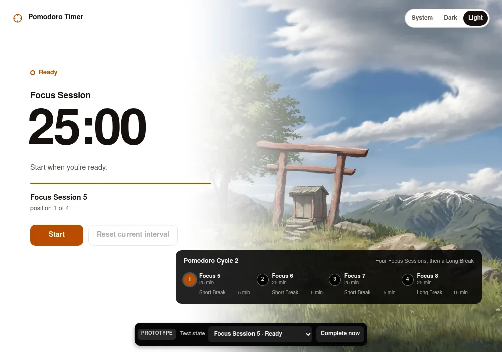
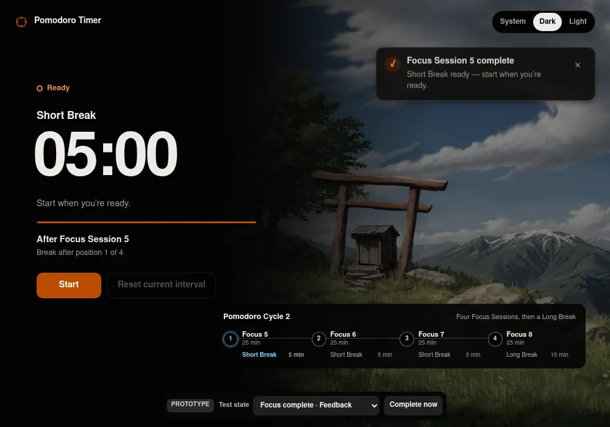
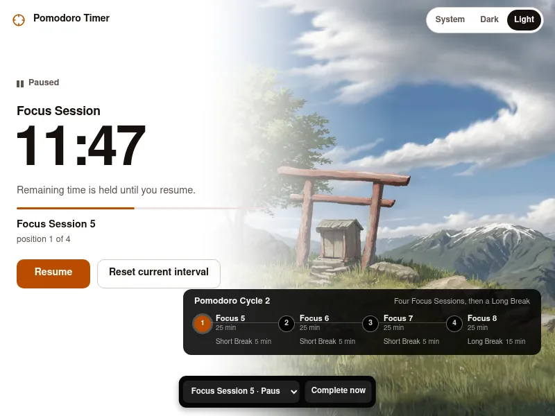

# Horizon + Cadence timer interface

Resolution asset for [Prototype the compact timer interface and themes](https://github.com/UmarKhan19/pomodoro/issues/6), selected with live feedback on 2026-07-15.

## Question

Which compact main-window design makes every agreed timer state and action immediately understandable?

## Selected direction

**Horizon + Cadence** is the selected v1 direction. It combines:

- an asymmetric, image-led timer surface with a crisp nature image masked into the right side;
- a quiet, high-contrast timer hierarchy on the left; and
- an explicit Pomodoro Cycle rail that names each Focus Session and its following Break.

This preserves Horizon’s modern, calm atmosphere without asking the user to infer Short and Long Break cadence from four unexplained dots.

## Information hierarchy

1. **Current state:** Ready, Running, or Paused appears as a text label with a non-color-only marker.
2. **Current interval:** Focus Session, Short Break, or Long Break sits directly above the dominant remaining time.
3. **State guidance:** one short sentence explains whether to Start, whether time is counting down, or whether remaining time is held.
4. **Timer Run context:** the current Focus Session Number or associated Focus Session appears with its position in the Pomodoro Cycle.
5. **Actions:** the valid Start, Pause, or Resume action is primary; Reset Current Interval remains secondary and is disabled for a Ready Interval.
6. **Cadence:** the lower rail shows the four Focus Sessions in the current Pomodoro Cycle and the Break following each one.
7. **Theme:** System, Dark, and Light remain available in a compact switcher at the top right.

## Pomodoro Cycle rail

For Pomodoro Cycle 2, the rail reads:

- Focus 5 → Short Break, 5 minutes
- Focus 6 → Short Break, 5 minutes
- Focus 7 → Short Break, 5 minutes
- Focus 8 → Long Break, 15 minutes

The numbers advance with the Timer Run rather than resetting visually to 1 each cycle. The current Focus Session or Break is explicitly highlighted; completed positions remain distinguishable from upcoming positions. Text always identifies the interval, so color is supplementary.

## State and feedback treatment

- **Ready Interval:** shows Start and a disabled Reset Current Interval.
- **Running Interval:** shows Pause and Reset Current Interval while the progress rule and remaining time advance.
- **Paused Interval:** shows Resume and Reset Current Interval; the copy states that remaining time is held.
- **Completion Feedback:** appears as a non-modal toast at the upper right while the newly prepared Ready Interval is already visible. Start dismisses it.
- **Breaks:** retain the same hierarchy as Focus Sessions. A related blue accent distinguishes the active Break in the cadence rail without carrying meaning alone.

## Visual direction

- Modern, calm, minimal product register.
- Restrained neutral surfaces with a burnt-orange primary action and a related blue Break accent.
- One system-oriented sans-serif family with tabular timer numerals.
- A crisp image rather than a blurred image. A left-to-right mask merges it into the timer surface without placing the controls on glass.
- The image is decorative: timer state, progression, and actions remain fully understandable if it is absent.
- Dark mode lowers image brightness while preserving detail; Light mode uses a white timer surface fading into the image.

The current mountain image is a resized placeholder derived from an existing local wallpaper. It is not the approved production asset.

## Accessibility and responsive behavior

- Target WCAG 2.2 AA.
- Full keyboard operation, visible focus, reduced-motion handling, sufficient contrast, and no color-only state cues.
- The cadence rail remains below the timer at a compact 800×600 viewport rather than obscuring controls.
- The selected prototype scored 100 in Lighthouse accessibility audits in both Light and Dark themes. An interactive smoke test covered Start, countdown, Pause, Reset, Completion Feedback dismissal on Start, theme persistence, and keyboard-focus continuity across state changes.

## Prototype source

The selected throwaway source is in [`prototypes/timer-interface/`](../../prototypes/timer-interface/README.md). It includes scenario controls for Ready, Running, Paused, Short Break, Long Break, and Completion Feedback. Those controls are prototype-only and must not ship.

## Screenshots

### Focus Session Ready — Light

### Completion Feedback — Dark

### Paused compact window — Light

## Remaining specification work

The production image source and rights, exact visual tokens, component-state details, and minimum supported content dimensions remain to be specified before implementation. The prototype establishes the interface direction rather than production-ready code or assets.
